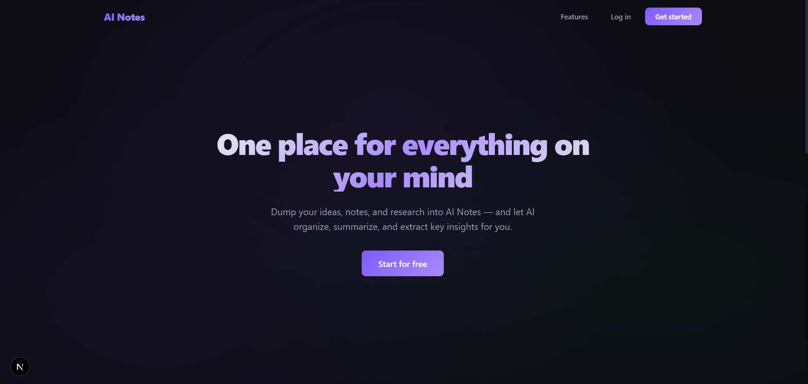
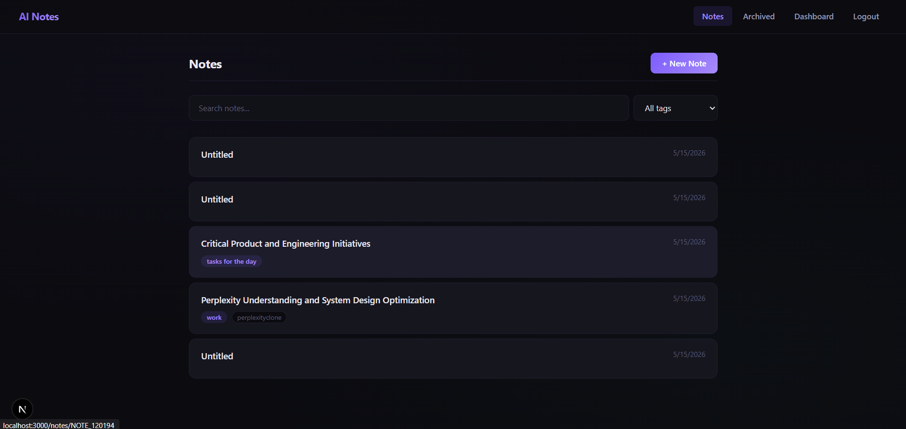
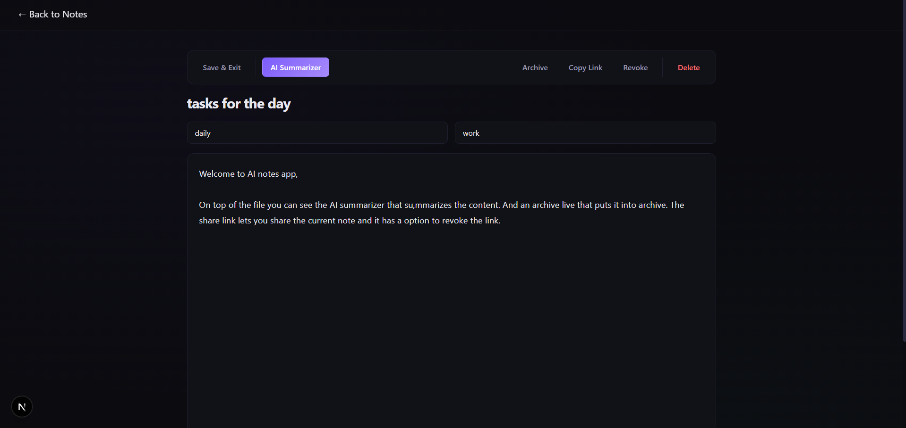
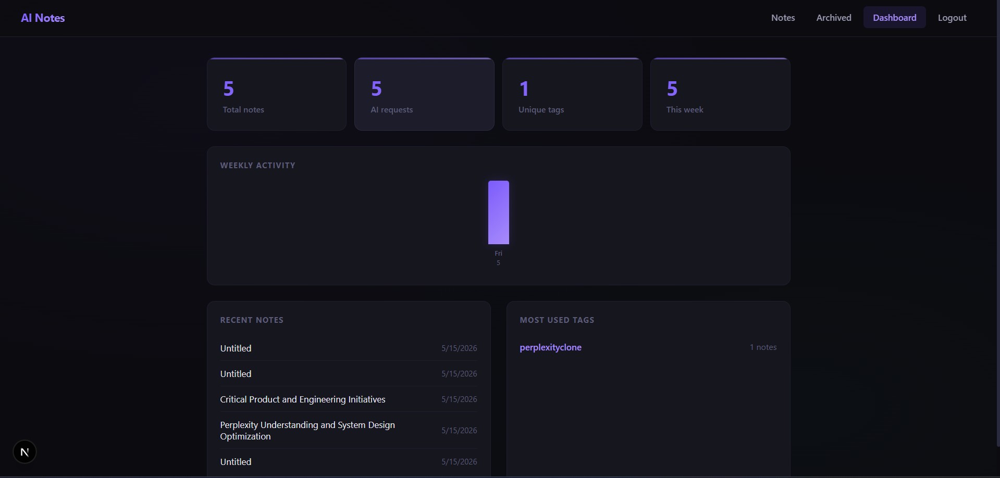
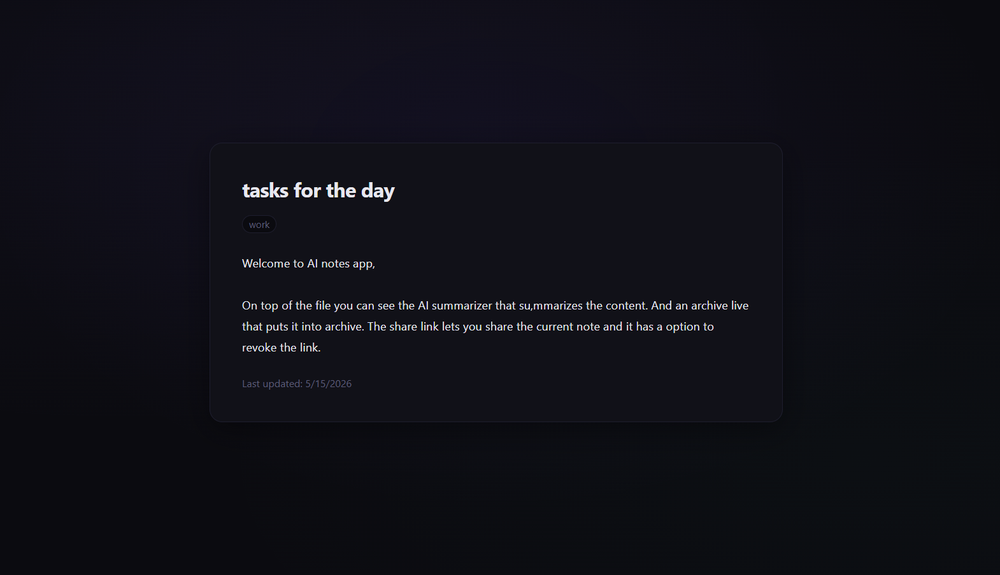

# AI Notes

A full-stack note-taking application with AI-powered summarization, smart organization, and public sharing. Built with a monorepo architecture using Turborepo.

## Architecture

```
AI-notes/
├── apps/
│   ├── backend/          # Express + Bun API server
│   │   ├── src/
│   │   │   ├── config/       # Database connection pool
│   │   │   ├── controllers/  # Request handlers
│   │   │   ├── middleware/   # Auth guard & error handler
│   │   │   ├── routes/       # Express route definitions
│   │   │   ├── schemas/      # Zod validation schemas
│   │   │   ├── services/     # Business logic layer
│   │   │   ├── types/        # TypeScript interfaces
│   │   │   └── utils/        # JWT, helpers, HttpError
│   │   └── migrations/       # SQL migration files
│   └── web/              # Next.js 16 frontend
│       ├── app/
│       │   ├── (auth)/       # Login/signup pages (redirect to modal)
│       │   ├── notes/        # Notes list, editor, archived views
│       │   ├── dashboard/    # Productivity insights dashboard
│       │   └── share/        # Public shared note pages
│       ├── components/       # React components
│       ├── context/          # Auth context provider
│       ├── hooks/            # Custom hooks (auto-save)
│       └── lib/              # API client
└── packages/             # Shared packages (ui, configs)
```

### Tech Stack

| Layer | Technology |
|-------|-----------|
| Runtime | Bun |
| Backend | Express 5 |
| Frontend | Next.js 16 (App Router) |
| Database | PostgreSQL (via Neon) |
| ORM | Raw SQL with `pg` |
| Auth | JWT + bcrypt (Bun native) |
| Validation | Zod 4 |
| AI | Google Gemini 2.5 Flash |
| Monorepo | Turborepo |

## Features

### 1. Authentication
- User signup and login with JWT-based sessions
- Persistent auth via localStorage tokens
- Protected routes and API endpoints
- Secure password hashing with Bun's native bcrypt

### 2. Notes Workspace
- Create, edit, and delete notes
- Auto-save with debounced saving (2s delay)
- Organize with tags and categories
- Archive/unarchive notes
- Keyword search across titles and content
- Filter by tags

### 3. AI Integration
- **AI Summarizer**: Processes title + content to extract structured key points, action items, and a suggested title
- Powered by Google Gemini 2.5 Flash
- Extracts clear, actionable items from messy/rough notes

### 4. Public Sharing
- Generate a unique share link for any note
- Shared notes accessible without login
- Revoke share links at any time
- Clean public-facing page

### 5. Productivity Dashboard
- Total notes count
- Recently edited notes (last 5)
- Most-used tags
- AI request statistics
- Weekly activity bar chart

## Screenshots

### Landing Page
The landing page features a hero section with gradient heading, feature cards, and a testimonial. Login/signup open in a modal overlay.


### Notes Interface
Browse, search, and filter notes. Each card shows title, category, tags, and last-updated date. Create new notes with the + button.


### Note Editor
Full editor with toolbar groups (Save, AI Summarizer, Archive, Share, Delete), meta fields for category/tags, auto-save status bar with word/char count, and AI results panel.


### Dashboard
Four stat cards (total notes, AI requests, unique tags, weekly count), a weekly activity bar chart, recent notes list, and most-used tags breakdown.


### Public Share Page
Clean read-only view of a shared note, accessible without authentication via a generated share link.


## Getting Started

### Prerequisites

- [Bun](https://bun.sh) >= 1.3
- [Node.js](https://nodejs.org) >= 18
- A PostgreSQL database (local or [Neon](https://neon.tech))
- A Google Gemini API key ([get one here](https://aistudio.google.com/apikey))

### Installation

```bash
# Clone the repository
git clone <repo-url> && cd AI-notes

# Install all dependencies (workspaces)
npm install
```

### Environment Variables

Copy the example env files and fill in your credentials:

```bash
# Backend
cp apps/backend/.env.example apps/backend/.env

# Frontend
cp apps/web/.env.example apps/web/.env.local
```

**Backend `.env` variables:**

| Variable | Description |
|----------|-------------|
| `POSTGRES` | PostgreSQL connection string |
| `JWT_SECRET` | Secret key for signing JWT tokens |
| `GEMINI_API_KEY` | Google Gemini API key |
| `CORS_ORIGIN` | Frontend URL (default: http://localhost:3000) |
| `PORT` | Server port (default: 4000) |

> **Note**: `OPENAPI_KEY` is also supported as an alias for `GEMINI_API_KEY` for backwards compatibility.

### Database Setup

```bash
# Run migrations
cd apps/backend
bun run db:migrate
```

This creates the `users`, `notes`, and `user_stats` tables with the required indexes.

### Running the Application

Start both services in separate terminals:

```bash
# Terminal 1: Backend (Express API on :4000)
cd apps/backend
bun run dev

# Terminal 2: Frontend (Next.js on :3000)
cd apps/web
npm run dev
```

Or use Turborepo from the root to run both:

```bash
npm run dev
```

Open [http://localhost:3000](http://localhost:3000) in your browser.

### Testing

```bash
# Type checking
npm run check-types

# Linting
npm run lint
```

## Deployment

### Build (from repo root)

```bash
bun install
bun run build
```

This builds the Next.js frontend (`apps/web/.next`) and bundles the backend (`apps/backend/dist`).

### Environment variables

| App | File | Required variables |
|-----|------|-------------------|
| Backend | `apps/backend/.env` | `POSTGRES`, `JWT_SECRET`, `GEMINI_API_KEY`, `CORS_ORIGIN`, `PORT` |
| Frontend | `apps/web/.env.local` | `NEXT_PUBLIC_API_URL` (your deployed API URL) |

Copy from the `.env.example` files in each app directory.

### Database

Run migrations before starting the API (or on each deploy):

```bash
bun run db:migrate
```

### Production start

```bash
# Backend (port 4000)
bun run start:backend

# Frontend (port 3000)
bun run start:web
```

**Typical hosting:** deploy the backend to Railway/Fly/Render (Bun runtime, `build` + `start` commands above). Deploy the frontend to Vercel with `NEXT_PUBLIC_API_URL` pointing at your API. Set backend `CORS_ORIGIN` to your frontend URL.

## API Endpoints

### Auth
| Method | Path | Description |
|--------|------|-------------|
| POST | `/api/auth/signup` | Create account |
| POST | `/api/auth/login` | Sign in |
| GET | `/api/auth/me` | Get current user |

### Notes (all require auth)
| Method | Path | Description |
|--------|------|-------------|
| GET | `/api/notes` | List notes (supports `?keyword=`, `?tag=`, `?archived=true`) |
| POST | `/api/notes` | Create note |
| GET | `/api/notes/:id` | Get note |
| PATCH | `/api/notes/:id` | Update note |
| DELETE | `/api/notes/:id` | Delete note |
| POST | `/api/notes/:id/archive` | Archive note |
| POST | `/api/notes/:id/unarchive` | Unarchive note |
| POST | `/api/notes/:id/share` | Generate share link |
| POST | `/api/notes/:id/revoke-share` | Revoke share link |

### AI (requires auth)
| Method | Path | Description |
|--------|------|-------------|
| POST | `/api/ai/process` | Process content with AI (returns summary, key points, suggested title) |

### Dashboard (requires auth)
| Method | Path | Description |
|--------|------|-------------|
| GET | `/api/dashboard` | Get insights data |

### Public
| Method | Path | Description |
|--------|------|-------------|
| GET | `/api/share/:share_id` | Get publicly shared note |

## Database Schema

### Users
- `id` — `USR_xxxxxx` (auto-generated)
- `name`, `email`, `password_hash`
- `created_at`, `updated_at`

### Notes
- `note_id` — `NOTE_xxxxxx` (auto-generated)
- `user_id` — foreign key to users
- `title`, `content`, `tags` (text array), `category`
- `share_id` (UUID, nullable), `is_public`
- `is_archived`, `created_at`, `updated_at`

### User Stats
- `user_id` — foreign key to users
- `ai_requests` — counter
